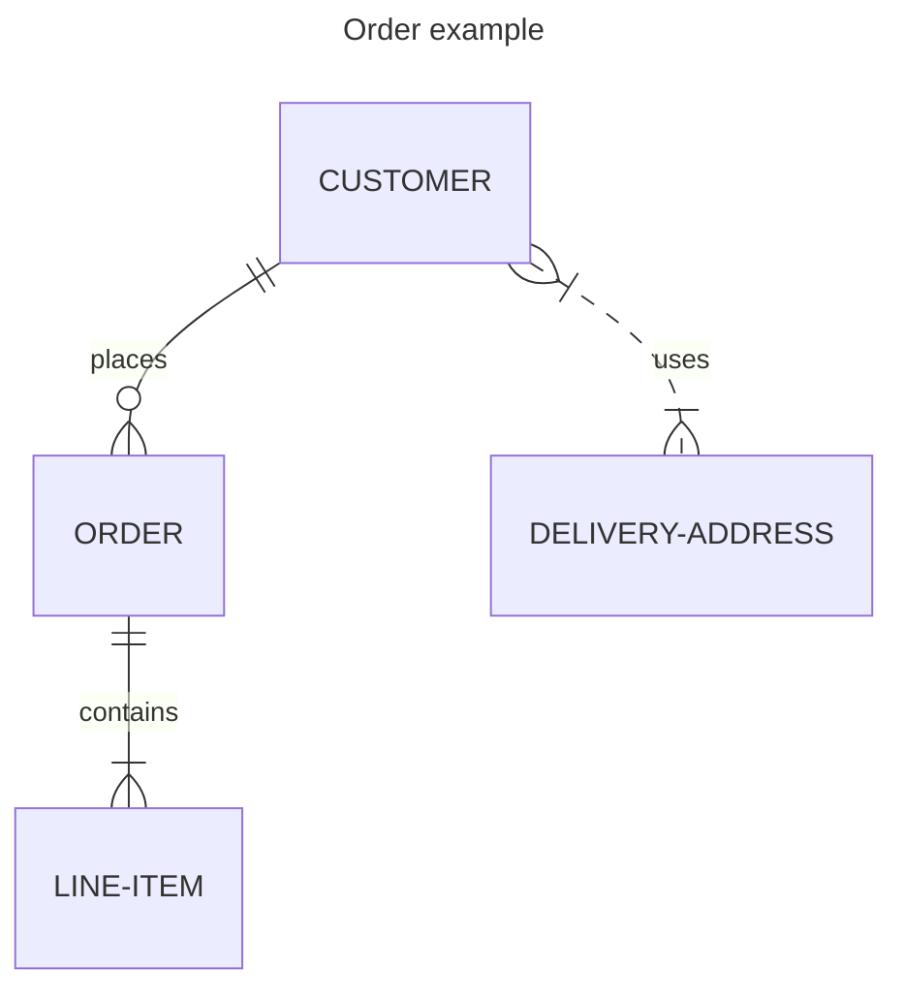

# mermaid_demo
mermaid.liveのデモ
## GitHubの markdownに含めることが出来る。
テキストで差分を管理出来るので、競合をある程度回避出来る

```mermaid
---
title: Order example
---
erDiagram
    CUSTOMER ||--o{ ORDER : places
    ORDER ||--|{ LINE-ITEM : contains
    CUSTOMER }|..|{ DELIVERY-ADDRESS : uses
```
